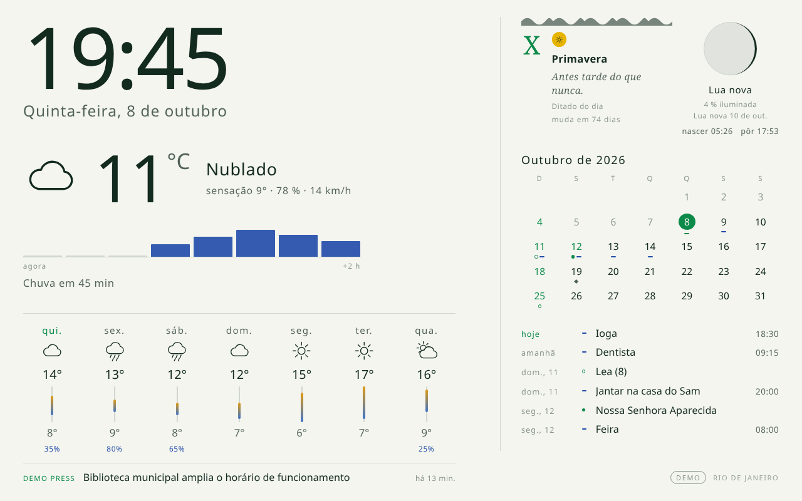
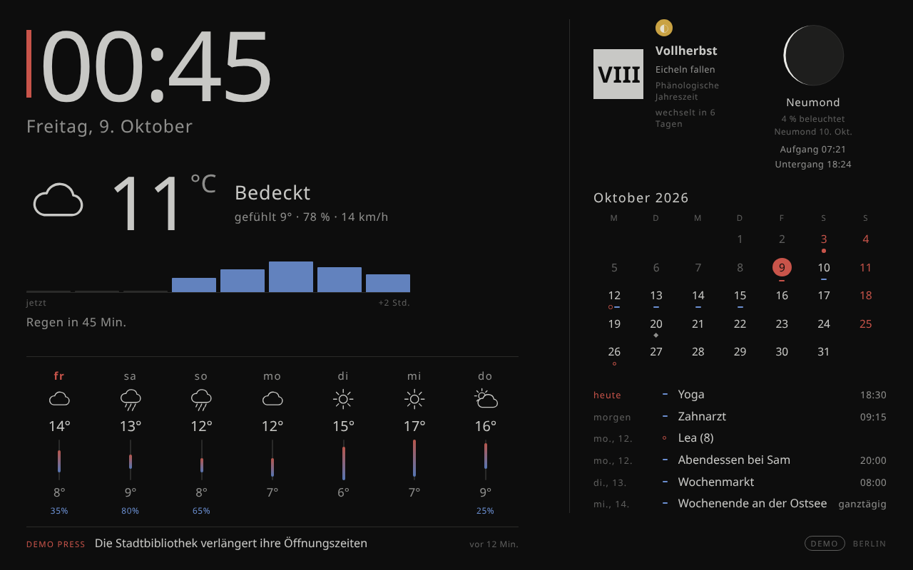
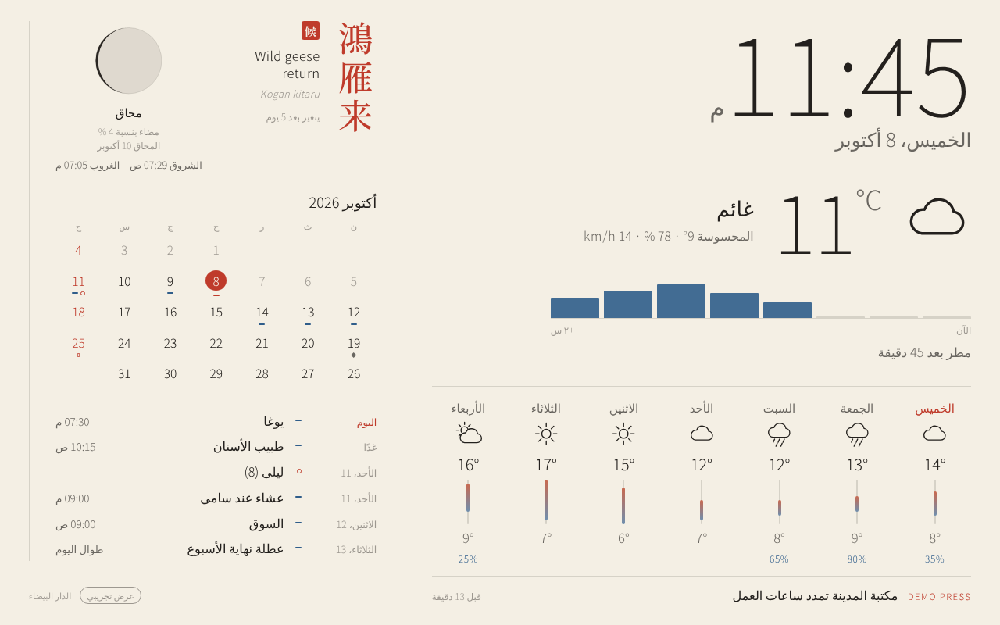

# Beranda

*Beranda* veut dire « véranda » en indonésien : un endroit calme pour voir sa journée d'un coup d'œil.

Un tableau de bord pour miroir connecté ou vieille tablette, fait pour un **Raspberry Pi 3B+ ou
plus récent** : l'heure, la météo et la pluie chez vous, la lune, votre agenda, les jours fériés
et les dates qui comptent, et une ligne de titres d'actualité. Clair le jour, sombre la nuit.
Gratuit : pas de compte, pas d'abonnement, pas d'API payante.

> **État : alpha (v0.3).** Tout ce qui suit fonctionne dans un navigateur. Ce n'est pas encore
> testé sur un vrai Raspberry Pi, et l'installateur en une ligne est la prochaine étape.
> 🇬🇧 [Read in English](README.md)

| | |
|---|---|
|  |  |
|  |  |

*Les captures utilisent des données de démonstration : météo, agenda et titres sont inventés ;
la lune, le soleil, les saisons et les jours fériés sont réels.* [Toutes les captures](docs/screenshots/)

## Ce que vous obtenez

- **L'heure et la date** dans votre langue.
- **La météo** : maintenant, la pluie dans les deux prochaines heures, les prévisions à 7 jours (Open-Meteo, gratuit).
- **La lune et le soleil** : phase de la lune, lever et coucher du soleil, tout est calculé sur le Pi.
- **Le calendrier** : votre agenda Google, Apple, Outlook, Nextcloud ou Proton (en lecture seule),
  les jours fériés de votre pays et vos propres dates (naissances, souvenirs, anniversaires).
- **L'actualité** : une ligne de titres en bas de l'écran. L'actualité de votre ville, les médias
  de votre pays, un média international dans votre langue, ou n'importe quel flux RSS.
- **Huit thèmes**, chacun avec sa façon de raconter la saison : Japon (72 micro-saisons),
  Indonésie (mangsa javanais), France (calendrier républicain), Allemagne (saisons de la nature),
  Espagne, Italie et Portugal (proverbe du mois), Brésil (dicton du jour, saisons de l'hémisphère sud).
- **13 langues** : anglais, français, allemand, espagnol, italien, portugais, portugais du Brésil,
  japonais, indonésien, arabe (de droite à gauche), swahili, amharique, afrikaans.
  [Pays couverts en Amérique latine et en Afrique](docs/COUNTRIES.md).
- **Une page de réglages** pour votre téléphone, en mots simples, avec de l'aide pas à pas.

## L'essayer sur votre ordinateur (2 minutes)

Il faut Python 3.11 ou plus récent.

```bash
git clone https://github.com/regis57/Beranda.git
cd Beranda
python3 -m venv .venv && . .venv/bin/activate
pip install .
beranda --demo
```

Ouvrez <http://localhost:8080> pour l'affichage et <http://localhost:8080/admin> pour les réglages.
Arrêtez avec Ctrl+C. Sans `--demo`, vous avez la vraie météo et votre agenda.

## L'installer sur un Raspberry Pi (à la main, pour l'instant)

1. **Préparer la carte.** Avec [Raspberry Pi Imager](https://www.raspberrypi.com/software/),
   choisissez *Raspberry Pi OS Lite (64-bit)*. Dans les réglages d'Imager, donnez un nom au Pi
   (par exemple `beranda`), votre Wi-Fi, un nom d'utilisateur et un mot de passe.
   [Guide officiel](https://www.raspberrypi.com/documentation/computers/getting-started.html).
2. **Vous y connecter** depuis votre ordinateur : `ssh votre-utilisateur@beranda.local`.
   [Guide officiel](https://www.raspberrypi.com/documentation/computers/remote-access.html).
3. **Installer Beranda** :
   ```bash
   sudo apt update && sudo apt install -y git python3-venv fonts-noto-core fonts-noto-cjk
   git clone https://github.com/regis57/Beranda.git && cd Beranda
   python3 -m venv .venv && . .venv/bin/activate && pip install .
   beranda
   ```
4. **Le régler depuis votre téléphone** : ouvrez `http://beranda.local:8080/admin` (même Wi-Fi
   que le Pi) et suivez les trois étapes en haut de la page.

Le démarrage automatique et l'affichage plein écran (mode kiosque) arrivent avec l'installateur (v0.4).

## Relier votre agenda

Beranda lit votre agenda grâce à un **lien** privé (une adresse « iCal » ou « ICS »). Il ne fait
que lire : il ne modifie jamais rien et ne demande jamais votre mot de passe. Collez le lien dans
*Réglages → 4. Votre agenda* et appuyez sur **Tester**.

| Agenda | Où trouver le lien | Guide officiel |
|---|---|---|
| **Google Agenda** | Sur un ordinateur : ⚙ → Paramètres → à gauche, cliquez sur votre agenda → *Intégrer l'agenda* → copiez *Adresse secrète au format iCal*. | [Aide Google](https://support.google.com/calendar/answer/37648?hl=fr) |
| **Apple iCloud** | Sur icloud.com/calendar : ⓘ à côté du calendrier → activez *Calendrier public* → *Copier*. | [Aide Apple](https://support.apple.com/fr-fr/guide/icloud/share-a-calendar-mm6b1a9479/icloud) |
| **Outlook / Microsoft 365** | Outlook sur le web : ⚙ Paramètres → Calendrier → Calendriers partagés → *Publier un calendrier* → choisissez-le → *Publier* → copiez le lien **ICS**. | [Aide Microsoft](https://support.microsoft.com/fr-fr/outlook/share-your-calendar-in-outlook-com) |
| **Nextcloud** | Application Agenda : menu de l'agenda → *Partager le lien* → copiez. Beranda transforme tout seul le lien de partage en bonne adresse. | [Manuel Nextcloud](https://docs.nextcloud.com/server/stable/user_manual/en/groupware/calendar.html#publishing-a-calendar) |
| **Proton Calendar** | Offres payantes : Paramètres → Calendriers → votre calendrier → *Partager avec tout le monde* → *Créer un lien* → *Copier le lien*. | [Aide Proton](https://proton.me/support/share-calendar-via-link) |

**Gardez ce lien pour vous** : toute personne qui l'a peut voir vos rendez-vous. Beranda ne le
garde que sur le Pi, dans un fichier lisible par vous seul. S'il fuite, créez-en un nouveau depuis
la même page (l'ancien cesse de marcher). Les liens qui commencent par `webcal://` marchent aussi.

## Les titres de l'actualité

Une ligne en bas de l'écran affiche les derniers titres, un par un, avec le nom du média.
Seulement des titres : pas d'images, pas de publicité, pas de pistage, pas de compte.

- **« Choisir pour moi »** (par défaut) : l'actualité qui cite votre ville (trouvée par
  [GDELT](https://www.gdeltproject.org/), un index libre et gratuit de la presse mondiale), deux
  médias de votre pays et un média international dans votre langue.
- **Choisir vous-même** parmi environ 70 flux gratuits : radios et télévisions publiques et grands
  journaux d'Europe, des Amériques, d'Afrique et d'Asie, et services internationaux (BBC, DW,
  France 24, RFI, ONU Info, Al Jazeera...).
- **Ajouter n'importe quel flux** : la plupart des sites d'information publient un lien RSS (cherchez
  le logo orange RSS, ou essayez l'adresse du site suivie de `/rss` ou `/feed`). Collez-le et
  appuyez sur **Tester**.

Chaque flux du catalogue est vérifié automatiquement chaque semaine.

## Vie privée et sécurité

- La page de réglages ne s'ouvre que depuis votre réseau à la maison, et peut demander un code PIN.
- Vos réglages restent sur le Pi. Le Pi ne parle qu'aux services que vous utilisez : Open-Meteo
  (météo), votre agenda, les flux d'actualité choisis, et GDELT si « actualité de ma ville » est
  activé (il envoie alors le nom de votre ville).
- N'ouvrez pas le port 8080 du Pi vers internet sur votre box.

## Pour contribuer

`pip install -e ".[dev]"`, puis `pytest` et `ruff check src tests scripts`.
Captures : `python scripts/screenshot.py` et `python scripts/screenshot_admin.py`.
Une nouvelle langue, c'est un fichier JSON dans `src/beranda/web/i18n/` (et si possible `i18n/admin/`).
Voir la [feuille de route](docs/ROADMAP.md).

## Crédits

Météo par [Open-Meteo](https://open-meteo.com/) (CC BY 4.0). Actualité locale par
[GDELT](https://www.gdeltproject.org/). Jours fériés par la bibliothèque
[holidays](https://github.com/vacanza/holidays). Les titres appartiennent à leurs éditeurs.

## Licence

MIT.
