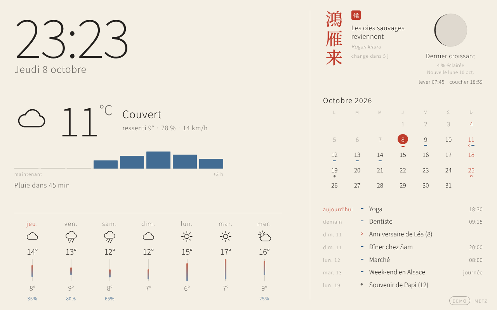
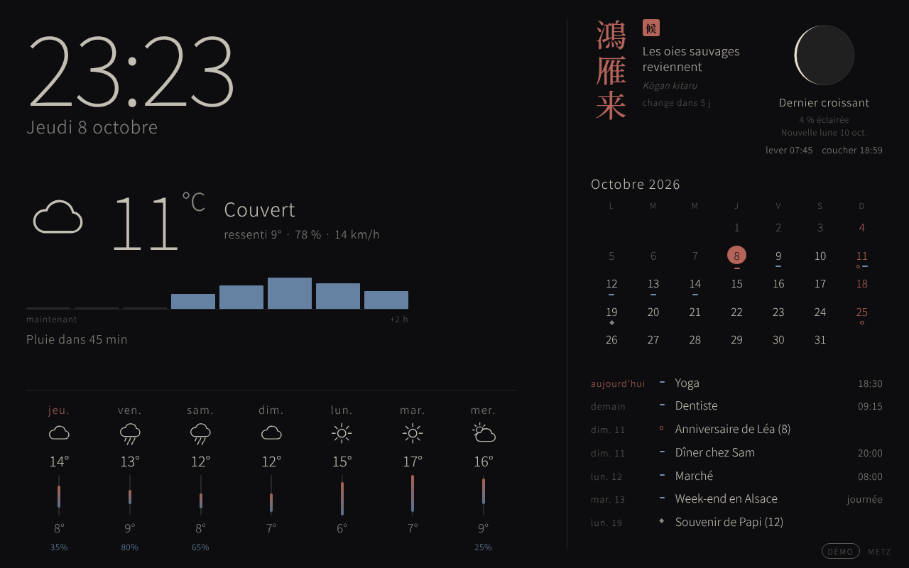

# Beranda

An open-source dashboard for a smart mirror or a big tablet, designed to run on a **Raspberry Pi 3B+** (Raspberry Pi OS Lite 64-bit). Light and lean: one small Python server, one vanilla-JS page, no build step, no paid API.

> **Status: alpha (v0.1).** The display page works in a desktop browser. It has **not been tested on real Raspberry Pi hardware yet**, and there is no installer yet.




*Screenshots use `--demo` data: weather and agenda are invented; moon, sun, micro-season and holidays are real.*

## What works today

- Responsive display page, light mode and automatic night mode (from the sun's position)
- Local weather, rain in the next 2 hours, 7-day forecast (Open-Meteo, free, no key)
- Moon phase and sun times, computed locally
- Japanese theme with the 72 micro-seasons (七十二候)
- Calendar highlighting public holidays for your country and your own key dates (births, deaths, anniversaries)
- Read-only calendars through ICS links (Google secret address, iCloud, Outlook, Nextcloud)
- Languages: fr, en, ja (English fallback)

## Quick start

```bash
git clone https://github.com/regis57/Beranda.git && cd Beranda
python -m venv .venv && . .venv/bin/activate
pip install -e .
beranda --demo          # then open http://localhost:8080
```

Real data: copy `config.example.toml` to `~/.config/beranda/config.toml`, edit it, run `beranda`.
Requires Python 3.11+. For Japanese glyphs install `fonts-noto-cjk`.

URL overrides for testing: `?mode=night`, `?lang=ja`.

## Credits

Weather data by [Open-Meteo](https://open-meteo.com/) (CC BY 4.0). See [docs/ROADMAP.md](docs/ROADMAP.md) for what comes next and what we deliberately won't do.

## Licence

MIT.
