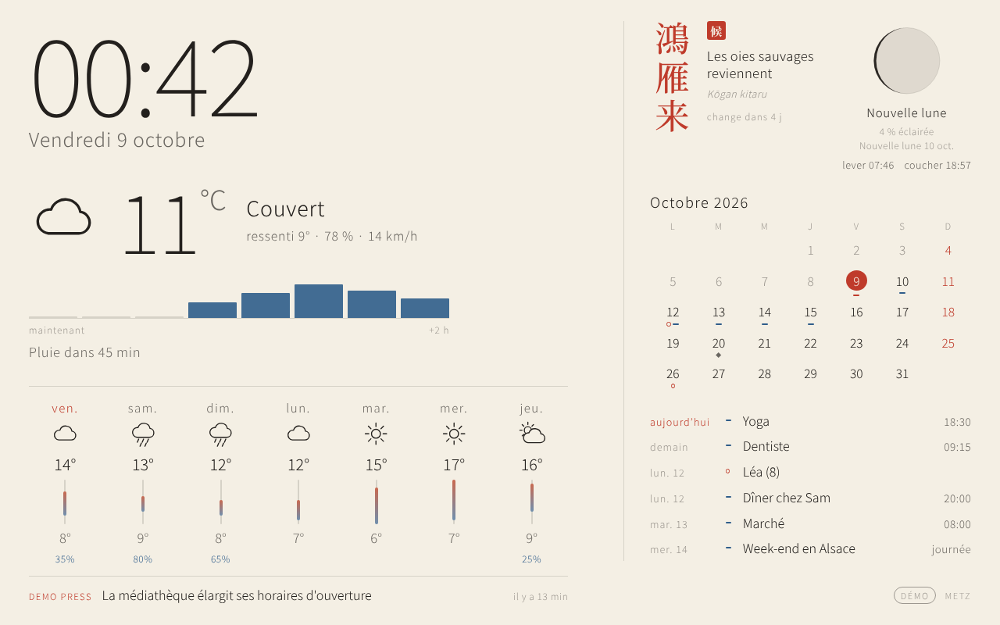
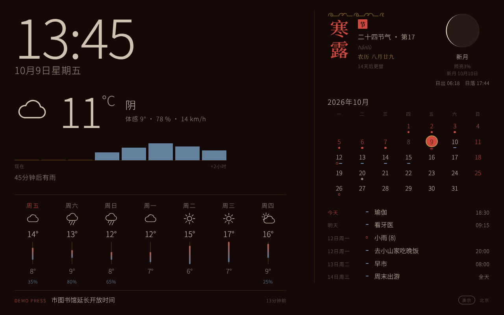
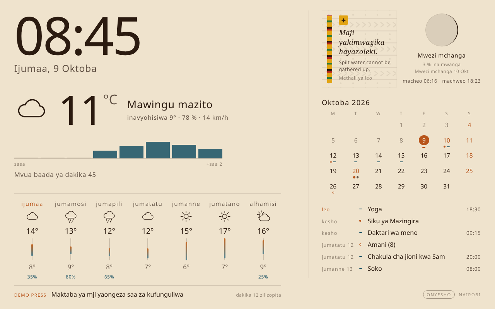
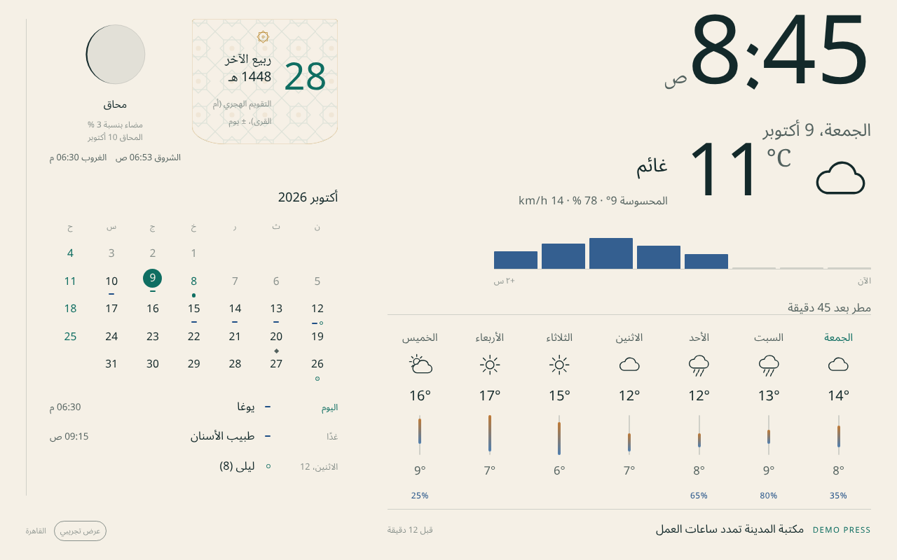
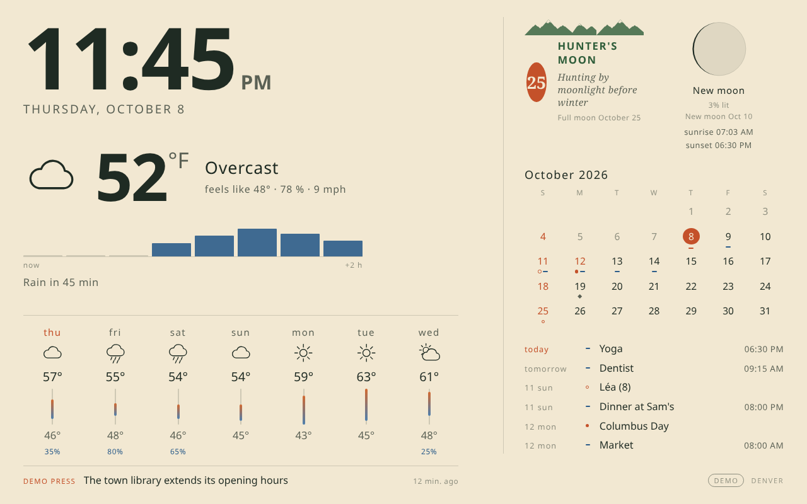
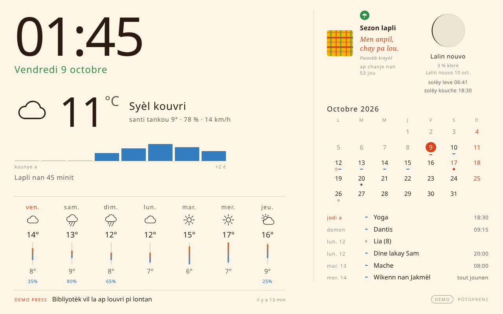

# Beranda

*Beranda* means "veranda" in Indonesian: a calm place to see the day at a glance.

A dashboard for a smart mirror or an old tablet, made for a **Raspberry Pi 3B+ or newer**:
clock, local weather and rain, moon, your calendar, holidays and dates that matter, and a line
of news headlines. Light by day, dark at night. Free: no account, no subscription, no paid API.

> **Status: alpha (v0.8).** The installer is tested automatically on a fresh Debian-family
> machine with systemd; the full-screen part has not been tried on a real Raspberry Pi yet.
> If you try it, please tell us how it went in an issue.
> 🇫🇷 [Lire en français](README.fr.md)

| | |
|---|---|
|  |  |
|  |  |
|  |  |

*Screenshots use demo data: weather, agenda and headlines are invented; moon, sun, seasons and
public holidays are real.* [All screenshots](docs/screenshots/)

## What you get

- **Clock and date** in your language.
- **Weather**: now, rain in the next two hours, seven-day forecast (Open-Meteo, free).
- **Moon and sun**: moon phase, sunrise and sunset, all calculated on the Pi.
- **Calendar**: your Google, Apple, Outlook, Nextcloud or Proton calendar (read-only), the
  public holidays of your country, and your own dates (births, remembrances, anniversaries).
- **News**: one line of headlines at the bottom. News about your town, your country's media,
  an international medium in your language, or any RSS feed you like.
- **15 themes**, each with its own way of telling the season: Japan (72 micro-seasons),
  China (24 solar terms and the lunar date), India (the ṛtu and the tithi), Arab world (Hijri
  date), Africa (a Swahili proverb a day), Indonesia (Javanese mangsa), Oceania (the Tahitian
  seasons of the Pleiades), Creole (carême or hivernage, a Creole proverb), North America
  (full-moon names), France (Republican calendar), Germany (seasons of nature), Spain, Italy and
  Portugal (proverb of the month), Brazil (saying of the day, southern seasons).
- **48 languages** for the screen, including Arabic, Hebrew, Persian and Urdu written right to
  left; **243 countries and territories** with their holidays, first day of the week and news.
  [Every country, every language](docs/COUNTRIES.md).
- **Made for a wall**: works upright (portrait) or sideways, turns the screen off at night,
  shows a QR code to set it up from your phone the first time.
- **A settings page** for your phone, in plain words, with step-by-step help.
- **Photo carousel**: point it at a folder on the Pi and it shows those pictures full-screen,
  alternating with the dashboard. Fill the folder with [rclone](https://rclone.org) (Google
  Drive, Dropbox, OneDrive, iCloud shared albums and many more) or
  [Syncthing](https://syncthing.net) (your phone's camera roll) — Beranda only ever reads
  what's already there, no cloud account of its own.
- **World radio**: search [Radio Browser](https://www.radio-browser.info)'s ~50,000 free
  stations, no account, and save favourites from the settings page. Plays through the Pi's
  own speakers or HDMI audio, not through your phone.
- **TV prime time**: point it at a free XMLTV guide (your provider's, or a community one such
  as [iptv-org/epg](https://github.com/iptv-org/epg)) and pick your channels; Beranda only ever
  reads that guide, it never hosts or scrapes a TV guide itself.
- **Voice control (optional, fully offline)**: a wake word, then a short sentence — the
  weather, the time, a favourite station, restarting the screen. Nothing is sent anywhere;
  it runs as its own service (`install.sh --with-voice`) using
  [openWakeWord](https://github.com/dscripka/openWakeWord),
  [Vosk](https://alphacephei.com/vosk/) and [Piper](https://github.com/rhasspy/piper).

## Try it on your computer (2 minutes)

You need Python 3.11 or newer.

```bash
git clone https://github.com/regis57/Beranda.git
cd Beranda
python3 -m venv .venv && . .venv/bin/activate
pip install .
beranda --demo
```

Open <http://localhost:8080> for the display and <http://localhost:8080/admin> for the settings.
Stop it with Ctrl+C. Without `--demo` you get real weather and your own calendar.

## Install on a Raspberry Pi (one line)

**What you need**: a Raspberry Pi 3B+ or newer, a microSD card (8 GB or more), a screen with
HDMI, and a phone or computer on the same Wi-Fi.

1. **Prepare the card.** Install [Raspberry Pi Imager](https://www.raspberrypi.com/software/)
   on your computer and choose *Raspberry Pi OS Lite (64-bit)*. When Imager offers to
   customise the system, give the Pi a name (for example `beranda`), your Wi-Fi name and
   password, a user name and password, and turn on SSH.
   [Official guide](https://www.raspberrypi.com/documentation/computers/getting-started.html).
2. **Start the Pi** with the card and the screen plugged in, wait two minutes.
3. **Connect to it** from your computer: open a terminal (on Windows: *PowerShell*) and type
   `ssh your-user@beranda.local`. [Official guide](https://www.raspberrypi.com/documentation/computers/remote-access.html).
4. **Install Beranda** by pasting this line (it takes 5 to 15 minutes on a Pi 3):
   ```bash
   curl -fsSL https://raw.githubusercontent.com/regis57/Beranda/main/install.sh | sudo bash
   ```
5. **Set it up from your phone**: the screen shows an address and a QR code. Scan it, or open
   `http://beranda.local:8080/admin`, and follow the three steps at the top of the page.

That's it: Beranda starts by itself at every boot, full screen. From the settings page you can
later **update** it, **restart the screen**, **restart the Pi**, **turn the picture** for a
screen hung upright, **turn the screen off at night**, and, at the bottom of the page,
**start over from scratch** — it erases every setting and brings back the first-run welcome
screen, without touching your photos or anything already downloaded (weather, TV guide…). That
last one is handy while you're trying Beranda out, or before handing it to someone else.

<details><summary>What the installer does, and options</summary>

It installs Python, the Noto fonts (for every script), Cage and Chromium (the full-screen
browser); creates a `beranda` user that runs everything (never root); puts Beranda in
`/opt/beranda` and your settings in `/etc/beranda`; and installs three services: the server,
the full-screen screen, and a small root service that only carries out the four requests of
the settings page (update, restart the screen, reboot, start over from scratch). Run the line
again to repair or update.

Options go after `bash -s --`, for example `... | sudo bash -s -- --no-screen`:
`--no-screen` (server only, to show it on a tablet or another device), `--hostname kitchen`
(rename the Pi: `http://kitchen.local:8080/admin`), `--branch NAME`, `--dry-run`.

Something wrong? `beranda doctor` checks everything and says what to fix.
To remove it: `sudo /opt/beranda/src/uninstall.sh` (add `--purge` to delete your settings too).
</details>

## Connect your calendar

Beranda reads your calendar through a private **link** (an "iCal" or "ICS" address). It only
reads: it never changes anything, and it never asks for your password. Paste the link in
*Settings → 4. Your calendar* and press **Test**. The settings page shows these same steps
under the box, with the official guide in your language.

| Calendar | Where to find the link | Official guide |
|---|---|---|
| **Google Calendar** | On a computer: ⚙ → Settings → click your calendar on the left → *Integrate calendar* → copy *Secret address in iCal format*. | [Google help](https://support.google.com/calendar/answer/37648) |
| **Apple iCloud** | On icloud.com/calendar: ⓘ next to the calendar → turn on *Public Calendar* → *Copy*. | [Apple help](https://support.apple.com/guide/icloud/share-a-calendar-mm6b1a9479/icloud) |
| **Outlook / Microsoft 365** | Outlook on the web: ⚙ Settings → Calendar → Shared calendars → *Publish a calendar* → choose it → *Publish* → copy the **ICS** link. | [Microsoft help](https://support.microsoft.com/en-us/outlook/share-your-calendar-in-outlook-com) |
| **Nextcloud** | Calendar app: calendar menu → *Share link* → copy. Beranda turns the share link into the feed by itself. | [Nextcloud manual](https://docs.nextcloud.com/server/stable/user_manual/en/groupware/calendar.html#publishing-a-calendar) |
| **Proton Calendar** | Paid plans: Settings → Calendars → your calendar → *Share with anyone* → *Create link* → *Copy link*. | [Proton help](https://proton.me/support/share-calendar-via-link) |

**Keep the link private**: anyone who has it can see your events. Beranda stores it only on the
Pi, in a file only you can read. If it leaks, make a new one from the same page (the old one
stops working). Links starting with `webcal://` work too.

## News headlines

One line at the bottom shows the latest headlines, one at a time, with the name of the medium.
Titles only: no pictures, no ads, no tracking, no account.

- **"Choose for me"** (default): news mentioning your town (found by [GDELT](https://www.gdeltproject.org/),
  a free open index of the world's press), two media of your country, and an international
  medium in your language.
- **Choose yourself** among 140 free feeds from every continent: public broadcasters and major newspapers of
  Europe, the Americas, Africa, Asia and Oceania, and international services (BBC, DW, France 24, RFI,
  UN News, Al Jazeera...).
- **Add any feed**: most news sites publish an RSS link (look for the orange RSS logo, or try the
  site address followed by `/rss` or `/feed`). Paste it and press **Test**.

Every feed of the catalog is checked automatically every week.

## Privacy and security

- The settings page only opens from your home network, and can ask for a PIN.
- Your settings stay on the Pi. The Pi talks only to the services you use: Open-Meteo (weather),
  your calendar, the news feeds you chose, and GDELT if "news about my town" is on (it then
  sends the name of your town).
- Do not open the Pi's port 8080 to the internet on your router.

## For contributors

`pip install -e ".[dev]"`, then `pytest` and `ruff check src tests scripts`.
Screenshots: `python scripts/screenshot.py` and `python scripts/screenshot_admin.py`.
A new language is one JSON file in `src/beranda/web/i18n/` (and optionally `i18n/admin/`).
See [docs/ROADMAP.md](docs/ROADMAP.md).

## Credits

Weather data by [Open-Meteo](https://open-meteo.com/) (CC BY 4.0). Town news by
[GDELT](https://www.gdeltproject.org/). Public holidays by the
[holidays](https://github.com/vacanza/holidays) library. Headlines belong to their publishers.

## Licence

MIT.
