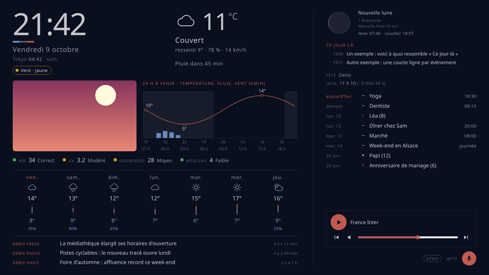
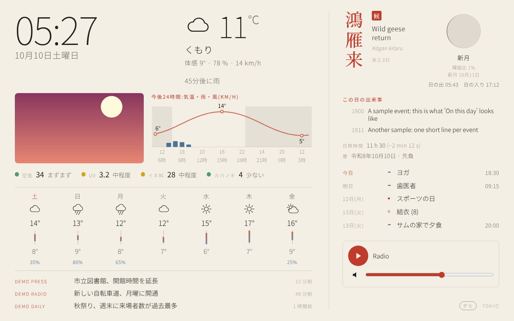
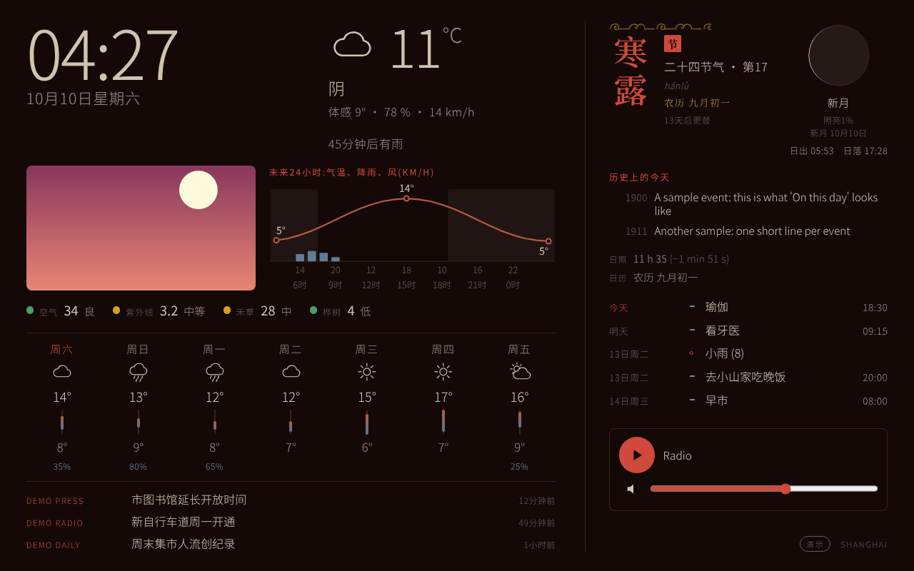
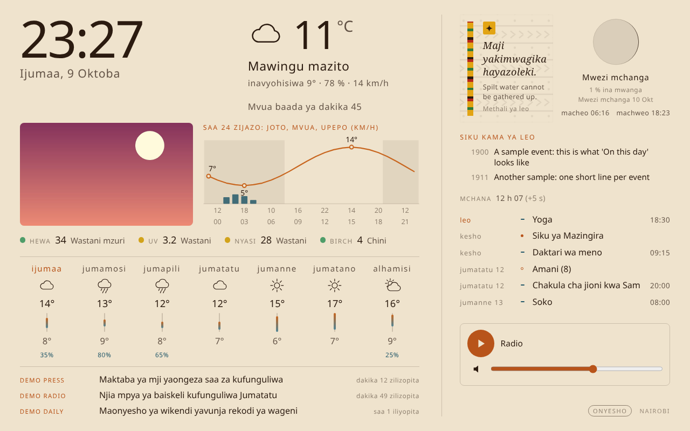
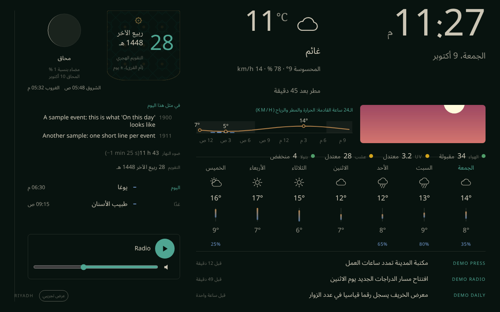

# Beranda

*Beranda* means "veranda" in Indonesian: a calm place to see your day at a glance.

**Turn a Raspberry Pi and any screen, or an old tablet, into a smart mirror or wall display**:
clock, weather, your calendar, the news, your photos, the radio and tonight's TV. Light by day,
dark at night. **Free**: no account, no subscription, no paid service.

[](https://buymeacoffee.com/regis57)
[](#licence)
🇫🇷 [Lire en français](README.fr.md) · 📖 [Full manual in the wiki](https://github.com/regis57/Beranda/wiki): [Install](https://github.com/regis57/Beranda/wiki/Install-and-Update) · [Settings](https://github.com/regis57/Beranda/wiki/Settings-box-by-box) · [Voice](https://github.com/regis57/Beranda/wiki/Voice-control) · [Troubleshooting](https://github.com/regis57/Beranda/wiki/Troubleshooting) · [Status](https://github.com/regis57/Beranda/wiki/Status) · [Roadmap](https://github.com/regis57/Beranda/wiki/Roadmap)



| | |
|---|---|
|  |  |
|  |  |

*Screenshots use demo data (weather, agenda and headlines are invented). 15 themes, 57 languages,
243 countries. [See them all](docs/COUNTRIES.md).*

## What you see on the screen

| | |
|---|---|
| **Time and weather** | Clock, date, weather now, rain in the next 2 hours, 7-day forecast, and a 24-hour graph (temperature, rain, wind, nights). Moon phase, sunrise and sunset. |
| **Your life** | Your calendar (Google, Apple, Outlook, Nextcloud, Proton), public holidays of your country, birthdays and dates that matter, your photos as a slideshow. |
| **The world** | News headlines, world radio (50,000 stations), tonight's TV, "On this day" in history. |
| **Handy extras** | Air quality, UV and pollen · official weather warnings for your area · name day, length of the day and your country's own calendar (Hijri, Chinese lunar, Japanese era...) · a small second clock. **Each one can be switched off.** |
| **Hands-free** | Optional voice control from the tablet's microphone: "what's the weather", "play France Inter", "next station". Works from a computer too: just open `https://` instead of `http://`. [How to use it](docs/VOICE.md) |
| **Made for a wall** | Works upright or sideways, turns the screen off at night, and each theme tells the season in its own culture. |

## Start in 2 minutes, on your computer

```bash
git clone https://github.com/regis57/Beranda.git && cd Beranda
python3 -m venv .venv && . .venv/bin/activate && pip install .
beranda --demo
```

Open <http://localhost:8080> (the display) and <http://localhost:8080/admin> (the settings).
You need Python 3.11 or newer. Drop `--demo` for your real weather and calendar.

## Install it on a Raspberry Pi

**You need**: a Raspberry Pi (3B+ or newer is the comfortable choice; older boards work in
light mode, see the [limits](#what-your-raspberry-pi-can-hold)), a microSD card of 8 GB or more (16 GB is more comfortable), a screen with
HDMI, and your phone or computer on the same Wi-Fi.

1. **Prepare the card** with [Raspberry Pi Imager](https://www.raspberrypi.com/software/): choose
   *Raspberry Pi OS Lite (64-bit)*. In the customise window, set a name (say `beranda`), your
   Wi-Fi, a user and password, and turn on SSH.
2. **Plug in the screen and the card**, power on, wait two minutes.
3. **Open a terminal** on your computer (on Windows: *PowerShell*) and type
   `ssh your-user@beranda.local`.
4. **Paste this line** (5 to 15 minutes on a Pi 3):
   ```bash
   curl -fsSL https://raw.githubusercontent.com/regis57/Beranda/main/install.sh | sudo bash
   ```
5. **Finish from your phone**: the screen shows a QR code. Scan it, or open
   `http://beranda.local:8080/admin`.

Beranda then starts by itself at every boot, full screen. Something wrong? Run `beranda doctor`.
**Wi-Fi made easy**: add, switch or forget networks from the settings page (box 13). And if one day
the Pi finds no known network (new box, changed password), it opens its own "Beranda setup" Wi-Fi so
your phone can pick the right one, with no keyboard ([how it works](docs/WIFI_SETUP.md)).

<details><summary>Use an old tablet as the screen, installer options, uninstall</summary>

**Tablet or phone as the screen**: install with `--no-screen` on the Pi (or any computer), then open
`http://beranda.local:8080` in the tablet's browser (Google Chrome recommended: Edge caused trouble) and add it to the home
screen. The radio and the voice use **the tablet's** speakers and microphone.

Options go after `bash -s --`, for example `... | sudo bash -s -- --no-screen`:
`--no-screen`, `--hostname kitchen`, `--no-wifi-setup`, `--branch NAME`, `--dry-run`.

The installer adds Python, fonts for every script, Cage and Chromium (the full-screen browser),
a `beranda` user (never root), and three services: the server, the full-screen display, and a small
root service that only carries out the four buttons of the settings page (update, restart the
screen, reboot, start over). Run the line again to update or repair.

To remove it: `sudo /opt/beranda/src/uninstall.sh` (add `--purge` to delete your settings too).
</details>

## Set it up from your phone

Open `http://beranda.local:8080/admin` (**Google Chrome** works best). A ☰ menu jumps to any section; every section has a
**Need help?** link in plain words. The essentials, in order:

1. **Where are you?** Type your town and pick it. Weather, sun and moon follow.
2. **Country and language.** Public holidays, first day of the week and the screen language.
3. **Look.** Pick a theme; the preview updates live.
4. **Extras of the main screen.** Switch the graph, air quality, warnings, ephemeris and second clock on or off.
5. **Your calendar, news, photos, radio, TV, voice.** All optional, each in its own section.
6. **Advanced user** (rarely needed). Change the port `8080` if another program already uses it, or start over from scratch. The page spells out what changes before you confirm.

Press **Save**: the screen follows within a minute. Every box explained: [Settings, box by box](https://github.com/regis57/Beranda/wiki/Settings-box-by-box).

### Connect your calendar

Beranda reads your calendar through a private **link** (an "iCal / ICS" address). It only reads,
never changes anything and never asks for your password. Paste the link in the calendar section and press **Test**.

| Calendar | Where to find the link | Official guide |
|---|---|---|
| **Google Calendar** | Settings → your calendar → *Integrate calendar* → *Secret address in iCal format* | [help](https://support.google.com/calendar/answer/37648) |
| **Apple iCloud** | icloud.com/calendar → ⓘ next to the calendar → *Public Calendar* → *Copy* | [help](https://support.apple.com/guide/icloud/share-a-calendar-mm6b1a9479/icloud) |
| **Outlook / Microsoft 365** | Settings → Calendar → Shared calendars → *Publish a calendar* → copy the **ICS** link | [help](https://support.microsoft.com/en-us/outlook/share-your-calendar-in-outlook-com) |
| **Nextcloud** | Calendar → *Share link* → copy (Beranda converts it) | [manual](https://docs.nextcloud.com/server/stable/user_manual/en/groupware/calendar.html#publishing-a-calendar) |
| **Proton Calendar** | Paid plans: Settings → Calendars → *Share with anyone* → *Copy link* | [help](https://proton.me/support/share-calendar-via-link) |

**Keep the link private**: anyone who has it can read your events. It is stored only on your Pi. If it leaks,
make a new one from the same page and the old one stops working.

### News

*Choose for me* (default) picks news about your town, two media of your country and an international
one in your language. Or choose among 140 free feeds from every continent, or paste any RSS link.
Titles only: no pictures, no ads, no tracking. Every feed of the catalog is checked every week.

## What your Raspberry Pi can hold

Every calendar, feed or channel you add is one more download to keep in memory, and small boards
have little. Beranda recognises your board and its memory, and sets the **maximum** for each list
(the settings page says so when you reach it, instead of slowing down). Nothing to configure.

| Board | Memory | Profile | Calendars | News sources* | TV channels | Radio stations | Dates | Photos | Voice phrases |
|---|---|---|---|---|---|---|---|---|---|
| Pi 2, Zero 2 W | 0.5 – 1 GB | light | 3 | 8 | 15 | 15 | 100 | 200 | 20 |
| **Pi 3 / 3B+, Pi 4** | 1 GB | **standard** | 10 | 20 | 40 | 30 | 200 | 500 | 50 |
| Pi 4, Pi 5 | 2 GB | comfortable | 15 | 30 | 60 | 50 | 400 | 800 | 80 |
| Pi 4, Pi 5, Pi 400 | 4 GB | comfortable + | 25 | 50 | 100 | 80 | 800 | 1,500 | 120 |
| Pi 4, Pi 5 | 8 GB or more | maximum | 40 | 80 | 150 | 120 | 1,500 | 3,000 | 200 |

*\*media and your own RSS feeds together. A computer that is not a Raspberry Pi is judged by its memory.*

What the **screen** shows is capped separately, and the rest simply rotates: 3 headlines at a time
(a new set every 12 s), up to 10 TV channels per page, up to 8 agenda lines, 3 warnings, 3 pollens.

These numbers are a careful estimate, not a benchmark: only some boards have been tried by the author.
You know better? Force a profile in `config.toml` (`[limits]` / `profile = "plus"`) or tell us what
your board handled in an [issue](https://github.com/regis57/Beranda/issues).

## If the settings page does not answer

From a computer on the same Wi-Fi, connect to the Pi and let Beranda check itself:

```bash
ssh your-user@beranda.local
sudo beranda doctor
```

It says what is wrong and on which address Beranda really answers (for example after a port
change, or after *Start over*, which brings the port back to 8080). Then, as needed:

| To... | Type |
|---|---|
| see whether it runs, and why it stopped | `sudo systemctl status beranda` then `sudo journalctl -u beranda -n 50` |
| restart it | `sudo systemctl restart beranda beranda-kiosk` |
| update or repair it (keeps your settings) | `curl -fsSL https://raw.githubusercontent.com/regis57/Beranda/main/install.sh \| sudo bash` |
| read the port it uses | `sudo grep -A3 '\[server\]' /etc/beranda/config.toml` |
| free space on the SD card (also done by every update) | `sudo apt clean && sudo apt autoremove --purge && sudo journalctl --vacuum-size=50M` |

## Privacy

- The settings page only opens from your home network, and can ask for a PIN. Do not open port 8080 to the internet.
- Your settings stay on your Pi. It only talks to the services you use: Open-Meteo (weather, air),
  your calendar, the feeds you chose, and, if you switch them on, GDELT ("news about my town" sends the name of your town),
  MeteoAlarm (warnings), nameday.abalin.net (name days), Wikipedia, Radio Browser and your TV guide.
- Voice uses your browser's own speech service (Chrome and Edge send the sound to their maker). Beranda keeps nothing.

## Help, contribute, support

- **Stuck?** `sudo beranda doctor`, [Troubleshooting](https://github.com/regis57/Beranda/wiki/Troubleshooting), or [open an issue](https://github.com/regis57/Beranda/issues) and attach the **diagnostic file** (settings page → *Advanced user* → *Download the diagnostic file*; it holds no password or private link).
- **Contribute**: start with [Contributing](https://github.com/regis57/Beranda/wiki/Contributing) and [Architecture](https://github.com/regis57/Beranda/wiki/Architecture). A new language is one JSON file in `src/beranda/web/i18n/`. [Status](https://github.com/regis57/Beranda/wiki/Status) · [Roadmap](https://github.com/regis57/Beranda/wiki/Roadmap).
- **Support**: Beranda stays free and open source. If it brightens your wall, [a coffee](https://buymeacoffee.com/regis57) is always welcome.

## Credits

Weather and air quality by [Open-Meteo](https://open-meteo.com/) (CC BY 4.0; air data from
[Copernicus CAMS](https://atmosphere.copernicus.eu)). Warnings by [MeteoAlarm](https://meteoalarm.org).
Name days by [nameday.abalin.net](https://nameday.abalin.net). Town news by [GDELT](https://www.gdeltproject.org/).
Radio by [Radio Browser](https://www.radio-browser.info). "On this day" by [Wikipedia](https://www.wikipedia.org).
Public holidays by the [holidays](https://github.com/vacanza/holidays) library. Headlines belong to their publishers.

## Licence

MIT.
