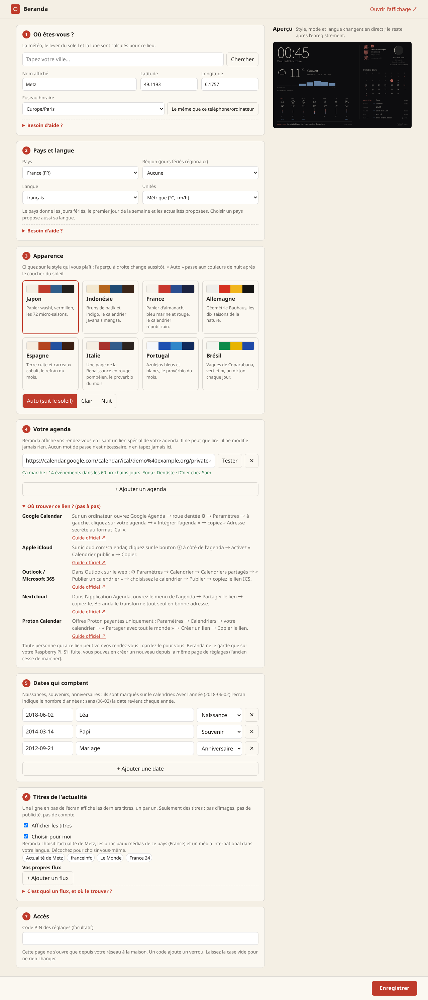

# Using Beranda

Two pages, served by the Pi:

- `http://<pi-name>.local:8080/` is **the display** (the mirror or tablet shows this one);
- `http://<pi-name>.local:8080/admin` is **the settings page**, for your phone or computer on the
  same Wi-Fi. It refuses visitors from the internet.

## The settings page, box by box

The first time, a short welcome lists the three things to do. Every box has a **Need help?**
link with the details in plain words.

| Box | What it does |
|---|---|
| **1. Where are you?** | Type your town, press *Search*, click the right line: name, position and time zone fill in. Without internet, type latitude and longitude (press and hold on your home in any map app to read them). |
| **2. Country and language** | The country gives public holidays, the first day of the week and the suggested news; picking it also proposes its language. 13 languages. A region is only needed for regional holidays. |
| **3. Look** | Eight themes, shown live in the preview. *Auto* switches to night colours after sunset. |
| **4. Your calendar** | Paste the private link of your calendar and press *Test*. The box *Where do I find this link?* gives the steps for Google, Apple, Outlook, Nextcloud and Proton, each with a link to the official guide in your language. |
| **5. Dates that matter** | Births, remembrances, anniversaries. `2018-06-02` shows the number of years; `06-02` repeats every year. |
| **6. News headlines** | On by default with *Choose for me*. Untick it to pick media yourself (your town, your country, international, another country) and add any RSS feed; every line has a *Test* button. |
| **7. Access** | Optional PIN. |

Press **Save**. The display picks the changes up within a minute, without a restart. The page
writes `~/.config/beranda/config.toml` (readable by you only, because calendar links are secrets).

## The themes

| Theme | Spirit | The season block |
|---|---|---|
| `japan` | washi paper, vermilion, ink | the 72 micro-seasons (七十二候) |
| `indonesia` | batik browns, indigo, a faint kawung motif | *pranata mangsa*, the Javanese farmers' calendar |
| `france` | almanac paper, navy, red, a tricolour rule | the Republican calendar: "16 Vendémiaire, Belle de nuit" |
| `germany` | Bauhaus: grey sheet, black, red, yellow | the ten phenological seasons of the DWD ("Vollherbst: Eicheln fallen") |
| `spain` | lime wash, terracotta, cobalt, Mudéjar star | the season and the *refrán* of the month |
| `italy` | a Renaissance page, Pompeian red | the season and the *proverbio* of the month |
| `portugal` | azulejos, cobalt on white | the season and the *provérbio* of the month |
| `brazil` | Copacabana waves, green and gold | the southern-hemisphere season and a *ditado* for every day |

Any theme works with any language. Try combinations without saving:
`/?theme=brazil&lang=pt-BR&mode=night`.

Honest notes: micro-season, mangsa and phenological dates are averages that move from year to
year; Republican day names and proverbs come from tradition and spellings vary. Corrections
are welcome.

## Without the settings page

Everything is in `config.toml`; see `config.example.toml`. The page is only a friendlier editor
for the same file (comments in the file are not kept when the page saves).
