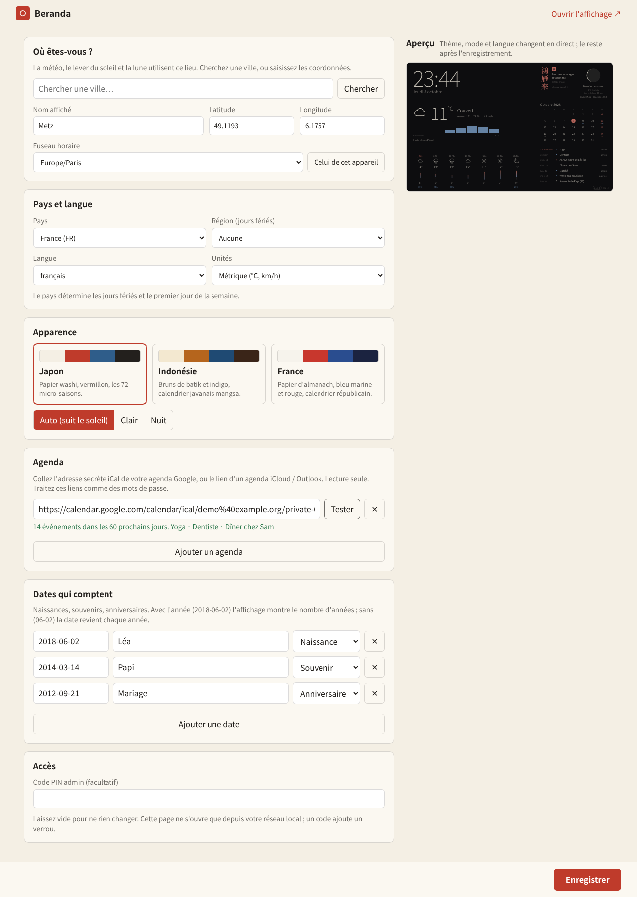

# Using Beranda

## 1. Start it

```bash
pip install -e .
beranda            # real data, from your config
beranda --demo     # invented weather and agenda, to try the look
```

Open `http://<address-of-the-pi>:8080/` on the mirror's screen (the display) and
`http://<address-of-the-pi>:8080/admin` on your phone or laptop (the settings).

## 2. The settings page (`/admin`)



The page works from any device on your home network. From the internet it answers
"403": it is not meant to be exposed. Changes are written to `~/.config/beranda/config.toml`
(readable by you only, because calendar links are secrets) and the display picks them up
at its next refresh, within a minute. There is no restart.

| Section | What to do |
|---|---|
| **Où êtes-vous ?** | Type a town and press *Search* (needs internet): name, coordinates and time zone fill in, and so does the country. Or type the coordinates by hand. |
| **Pays et langue** | The country gives the public holidays and the first day of the week; add a region for regional holidays. Language: français, English, 日本語, Bahasa Indonesia. Units switch to °F / mph on their own for the US. |
| **Apparence** | Pick a theme card (the preview on the right changes at once) and a mode: *Auto* follows the sun, or force light / night. |
| **Agenda** | Google: Settings of the calendar → *Secret address in iCal format*. iCloud: share the calendar publicly and copy the link. Outlook / Nextcloud: the ICS link. Paste it, press *Test* to see how many events it finds. Read-only. |
| **Dates qui comptent** | Name, date and kind (birth, remembrance, anniversary, other). `2018-06-02` shows the number of years; `06-02` repeats every year. |
| **Accès** | Optional PIN. Leave empty to keep the current state. |

Press **Enregistrer**. The bar at the bottom says *Modifications non enregistrées* until you do.

## 3. The three themes

| Theme | Spirit | Season block |
|---|---|---|
| `japan` | washi paper, vermilion, ink | the 72 micro-seasons (七十二候) |
| `indonesia` | batik browns, indigo, a faint kawung motif | *pranata mangsa*, the Javanese farmers' calendar (12 mangsa) |
| `france` | almanac paper, navy, red, a tricolour rule | the French Republican calendar: "16 Vendémiaire, Belle de nuit" |

Preview any combination without saving: `/?theme=france&lang=fr&mode=night`.

Honest notes: the micro-season and mangsa dates are the commonly published approximations,
the Republican day names are typed from the historical list; corrections are welcome. The
mangsa describe Java's monsoon, they are cultural colour, not a forecast.

## 4. Without the page

Everything is in `config.toml`; see `config.example.toml`. The page is only a friendlier editor
for the same file (comments in the file are not kept when the page saves).

## 5. Security in short

`/admin` only accepts local-network addresses, refuses cross-site writes, and can ask for a PIN.
It is still plain HTTP: do not forward its port on your router.
