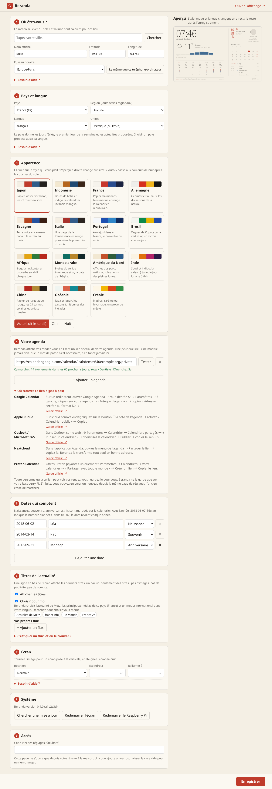

# Using Beranda

Two pages, served by the Pi:

- `http://<pi-name>.local:8080/` is **the display** (the mirror or tablet shows this one);
- `http://<pi-name>.local:8080/admin` is **the settings page**, for your phone or computer on the
  same Wi-Fi. It refuses visitors from the internet.

## The settings page, box by box

The first time, a short welcome lists the three things to do. Every box has a **Need help?**
link with the details in plain words.

| Box | What it does |
|---|---|
| **1. Where are you?** | Type your town, press *Search*, click the right line: name, position and time zone fill in. Without internet, type latitude and longitude (press and hold on your home in any map app to read them). |
| **2. Country and language** | The country gives public holidays, the first day of the week and the suggested news; picking it also proposes its language. 57 languages for the screen. A region is only needed for regional holidays. |
| **3. Look** | Fifteen themes, shown live in the preview. *Auto* switches to night colours after sunset. |
| **4. Extras of the main screen** | The 24-hour graph, air quality / UV / pollen, weather warnings, name day and local calendar, a second clock. Each one has its own tick box. |
| **5. Your calendar** | Paste the private link of your calendar and press *Test*. The box *Where do I find this link?* gives the steps for Google, Apple, Outlook, Nextcloud and Proton, each with a link to the official guide in your language. |
| **6. Dates that matter** | Births, remembrances, anniversaries. `2018-06-02` shows the number of years; `06-02` repeats every year. |
| **7. News headlines** | On by default with *Choose for me*. Untick it to pick media yourself (your town, your country, international, another country) and add any RSS feed; every line has a *Test* button. |
| **8. Photo frame** | *Add photos* from your phone or computer, or follow a shared Dropbox folder. |
| **9. World radio** | Search 50,000 stations and keep your favourites. |
| **10. TV tonight** | Pick a free guide for your country, then tick your channels. |
| **11. Voice control** | Optional; your own phrases can be added. See [VOICE.md](VOICE.md). |
| **12. Screen** | Rotation for a screen hung upright (90° or 270°) or upside down (180°), and the hours to turn it off at night. On the Pi the screen itself switches off; on a tablet the page goes dark. |
| **13. Wi-Fi** | The network in use and its strength; saved networks; *Search networks* and *Save this network*; *Use now* (goes back by itself if it fails); *Forget*. See [WIFI_SETUP.md](WIFI_SETUP.md). |
| **14. System** | Version, the board Beranda recognised (and so how much it can hold, see the README), *Check for updates*, *Update now*, *Restart the screen*, *Restart the Raspberry Pi*. Each button asks for a second click. They work when Beranda was installed with `install.sh`. |
| **15. Access** | Optional PIN. |
| **16. Advanced user** | Change the **port**, see the **secure address** (for the microphone), download a **diagnostic file** and **start over** (see below). |

### Advanced user: changing the port

The `8080` at the end of Beranda's address is its **port**. Change it only if another program on
the same device already uses 8080. Type a free number from 1024 to 65535 (for example 8081), press
the button twice, and Beranda:

- checks that the number is free, saves it and restarts (about ten seconds);
- restarts the screen plugged into the Pi, which then opens the new address by itself;
- sends this page to the new address (or shows it to you).

What you have to do yourself: update bookmarks and the home-screen shortcut of a tablet used as the
screen, and, if you use voice control, redo the one-time Chrome microphone setting with the new
address. If the new port cannot be used when Beranda starts, it goes back to 8080 on its own.
*Start over from scratch*, in the same box, also brings the port back to 8080 (you must type the
word "yes" in your language first).

### A secure address for the microphone

Browsers only give the microphone to "secure" pages. Beranda answers both ways on its one port:
`http://beranda.local:8080` as always, and `https://beranda.local:8080` (same address, with an "s"),
with a certificate it makes itself (it needs the `openssl` tool, already on Raspberry Pi OS). The
first visit shows a "connection not private" warning: choose *Advanced*, then *Continue*.
Details and the other way (a Chrome setting): [VOICE.md](VOICE.md).

### Advanced user: the diagnostic file

**Download the diagnostic file** gives a small text file: version, device (board, memory, temperature),
your settings, what the display shows right now (and which data is stale or failing), the recent log
lines and the browser of the page. It holds no password, calendar link, Dropbox link, feed address or
PIN; web addresses are cut to the site name and the place is rounded to about 10 km. Attach it to a
bug report.

### Advanced user: starting over

Two buttons, side by side in the same box:

- **Start over from scratch** erases your settings only. Your photos and what was already
  downloaded (weather, news, TV guide...) stay.
- **Start over and erase photos and data** also deletes the pictures of Beranda's own photo frame
  and everything downloaded. It asks twice: you type the word "yes" in your language, then a last
  reminder lists everything that will go (with the number of photos, which cannot be recovered)
  and the safe choice, *No, keep everything*, is the one highlighted. Photos in a folder you chose
  yourself are never touched.

Press **Save**. The display picks the changes up within a minute, without a restart. The page
writes `~/.config/beranda/config.toml` (readable by you only, because calendar links are secrets).

## The themes

| Theme | Spirit | The season block |
|---|---|---|
| `japan` | washi paper, vermilion, ink | the 72 micro-seasons (七十二候) |
| `indonesia` | batik browns, indigo, a faint kawung motif | *pranata mangsa*, the Javanese farmers' calendar |
| `france` | almanac paper, navy, red, a tricolour rule | the Republican calendar: "16 Vendémiaire, Belle de nuit" |
| `germany` | Bauhaus: grey sheet, black, red, yellow | the ten phenological seasons of the DWD ("Vollherbst: Eicheln fallen") |
| `spain` | lime wash, terracotta, cobalt, Mudéjar star | the season and the *refrán* of the month |
| `italy` | a Renaissance page, Pompeian red | the season and the *proverbio* of the month |
| `portugal` | azulejos, cobalt on white | the season and the *provérbio* of the month |
| `brazil` | Copacabana waves, green and gold | the southern-hemisphere season and a *ditado* for every day |
| `africa` | bogolan mud cloth and a kente band | a Swahili proverb (*methali*) every day, with its meaning |
| `arab` | zellige stars, emerald and gold | the Hijri date (Umm al-Qura), ±1 day where the moon is sighted |
| `america` | 1930s national-park posters | the name of the next full moon (Hunter's Moon, Cold Moon...) |
| `india` | marigold, indigo, a rangoli lotus | the season (ṛtu, शरद) and the lunar day (tithi) |
| `china` | rice paper by day, red lacquer by night | the 24 solar terms (寒露...) and the lunar date (农历八月廿九) |
| `oceania` | tapa cloth, lagoon, coral | the Tahitian seasons of the Pleiades (Matari'i i ni'a / i raro) |
| `creole` | madras check | carême or hivernage (or the austral seasons) and a Haitian Creole proverb |

Any theme works with any language. Try combinations without saving:
`/?theme=brazil&lang=pt-BR&mode=night`.

Honest notes: micro-season, mangsa and phenological dates are averages that move from year to
year; Republican day names and proverbs come from tradition and spellings vary. Corrections
are welcome.

## On the wall

- **First start**: until the settings are saved, the screen shows the address of the settings
  page and a QR code to scan with your phone.
- **Upright screen**: choose the rotation in box 7. On a tall screen everything fits on one
  page: calendar and agenda sit side by side.
- **Night**: set "turn off at" and "turn back on at" in box 7.

## Without the settings page

Everything is in `config.toml`; see `config.example.toml`. The page is only a friendlier editor
for the same file (comments in the file are not kept when the page saves).
